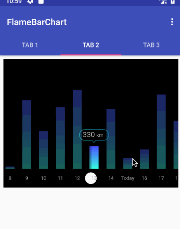

# FlameBarChart

一个炫酷的柱状图表。

# Import

# Usage

参数

    <declare-styleable name="TravelChart">
        <attr name="barWidth" format="dimension"/>
        <attr name="barInterval" format="dimension"/>
        <attr name="barDrawableDefault" format="reference"/>
        <attr name="barDrawablePressed" format="reference"/>
        <attr name="barDrawableFocused" format="reference"/>

        <attr name="barIndicatorDrawable" format="reference"/>
        <attr name="barIndicatorWidth" format="dimension"/>

        <!--顶部提示文字-->
        <attr name="barHintPadding" format="dimension"/>
        <attr name="barHintBackground" format="reference"/>
        <attr name="barHintBackgroundPadding" format="dimension"/>
        <attr name="barHintBackgroundPaddingLeft" format="dimension"/>
        <attr name="barHintBackgroundPaddingTop" format="dimension"/>
        <attr name="barHintBackgroundPaddingRight" format="dimension"/>
        <attr name="barHintBackgroundPaddingBottom" format="dimension"/>
        <attr name="barHintTextSize" format="dimension"/>
        <attr name="barHintTextColor" format="color"/>

        <!--底部x轴显示-->
        <attr name="xAxisPadding" format="dimension"/>
        <attr name="xAxisCurrentBackground" format="reference"/>
        <attr name="xAxisCurrentBackgroundPadding" format="dimension"/>
        <attr name="xLabelTextSize" format="dimension"/>
        <attr name="xLabelTextColor" format="color"/>
        <attr name="xLabelTextColorFocused" format="color"/>
    </declare-styleable>

回调

    onXAxisChangeListeners

# License

Copyright 2018 fanhl

Licensed under the Apache License, Version 2.0 (the "License");
you may not use this file except in compliance with the License.
You may obtain a copy of the License at

   http://www.apache.org/licenses/LICENSE-2.0

Unless required by applicable law or agreed to in writing, software
distributed under the License is distributed on an "AS IS" BASIS,
WITHOUT WARRANTIES OR CONDITIONS OF ANY KIND, either express or implied.
See the License for the specific language governing permissions and
limitations under the License.